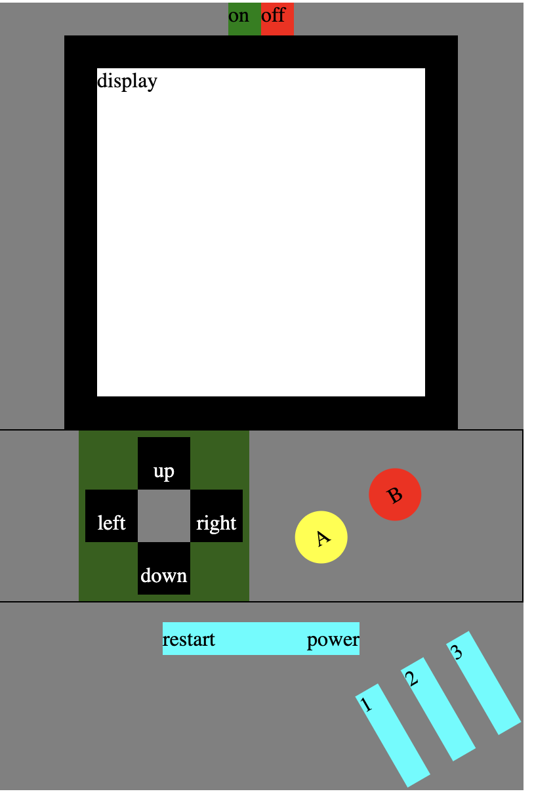
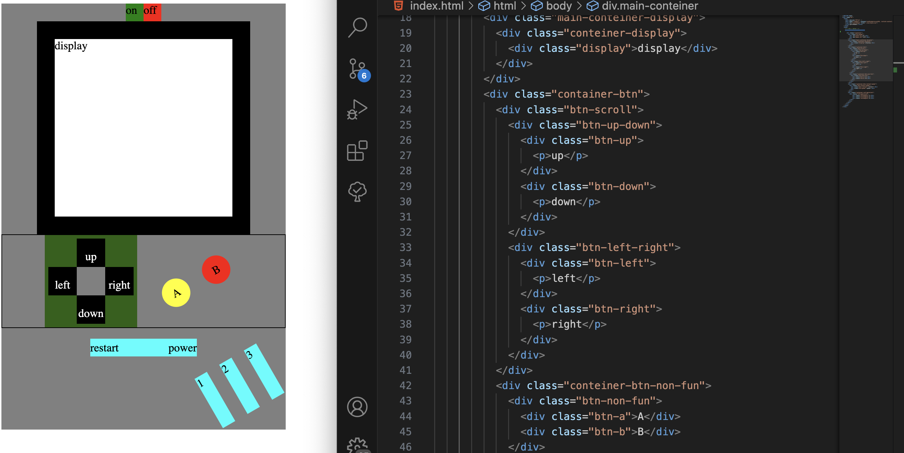
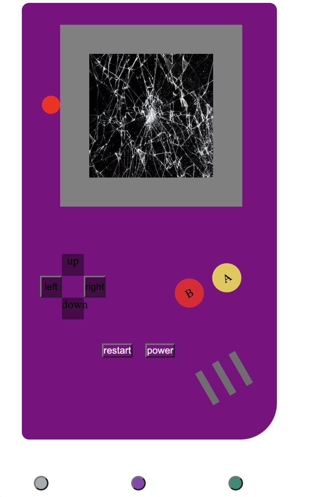

# Proyecto 2

  
Contenido 📝

  <ol>
    <li><a href="#objetivo-🎯">Objetivo</a></li>
    <li><a href="#sobre-el-proyecto-🔎">Sobre el proyecto</a></li>
    <li><a href="#deploy-🚀">Deploy</a></li>
    <li><a href="#vistas">Vistas</a></li>
    <li><a href="#contacto">Contacto</a></li>
  </ol>

## Objetivo 🎯

EL objetivo de este proyecto es reproducir la imagen frontal de nuestra videoconsola portátil o de sobremesa favorita, siendo válida cualquier marca y época. Deberemos poner en práctica conocimientos de JavaScript y
DOM/BOM que hemos adquirido, debe ser dinámica, y permitir cambiar al menos tres imágenes, al pulsar el boton de reseteo debe mostrar la imagen inicial y el botón de on/off apagará o encenderá el sistema.

## Sobre el proyecto 🔎

Segundo proyecto realizado en GeeksHubs! donde pondremos a prueba nuestros conocimientos 🧠 de JavaScript, he decidido elegir la consola de GameBoy, para realizar este proyecto, que iré actualizando a medida que vaya adquiriendo más conocimiento siendo esta la primera parte del segundo proyecto 2.

## Deploy 🚀

    <a href="https://p421k.github.io/proyecto2/"><strong>Url para ir a Proyecto 2! </strong></a>🚀🚀🚀

## Vistas

Ejemplo

## Contacto

